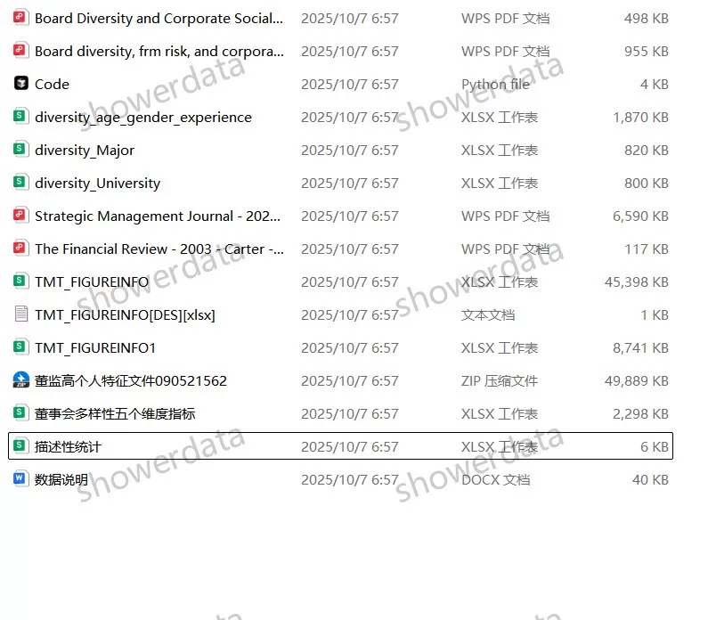
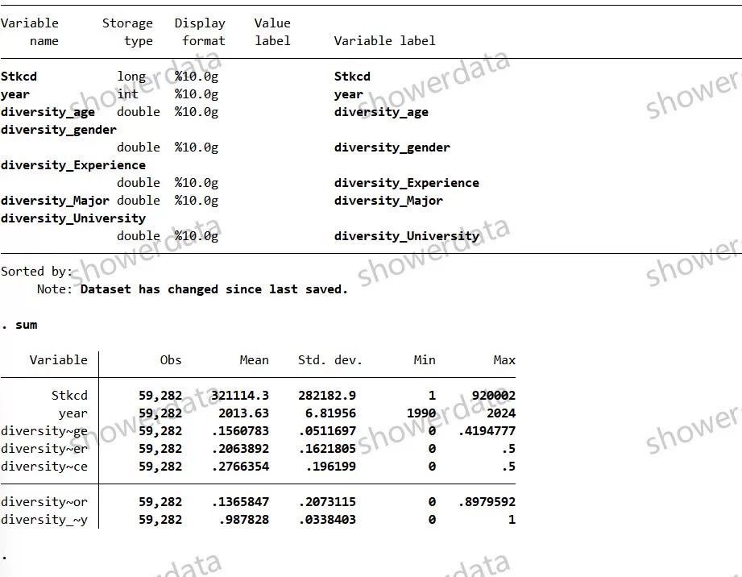
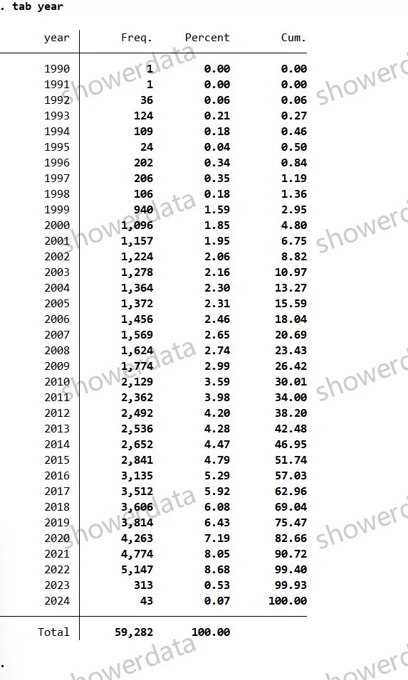
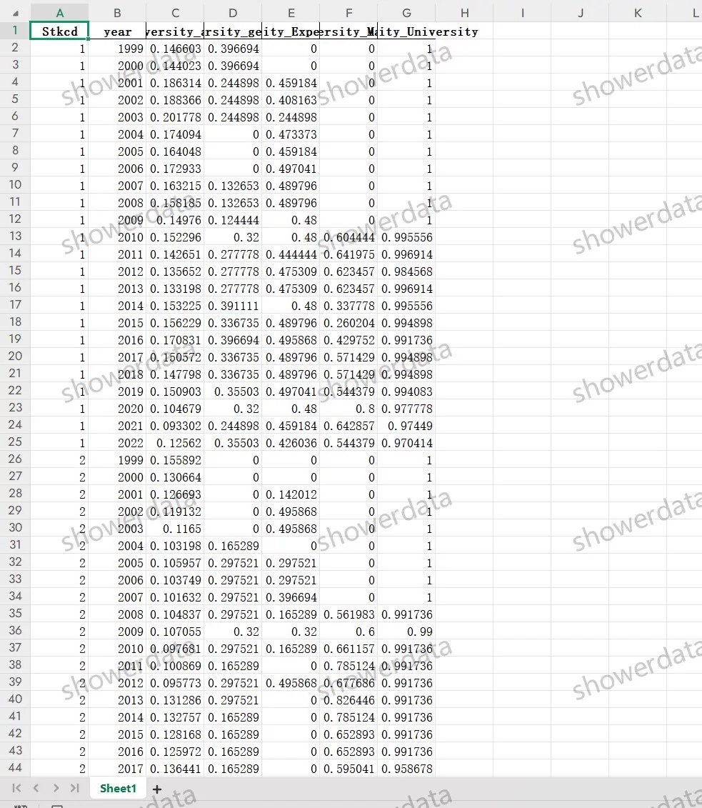
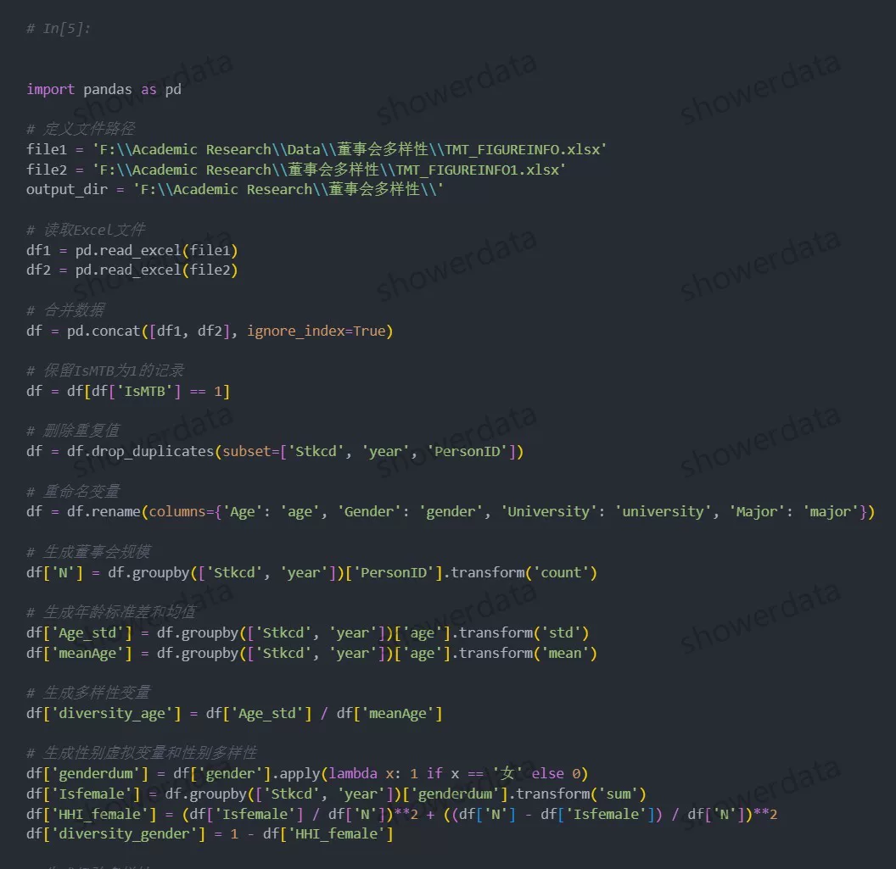
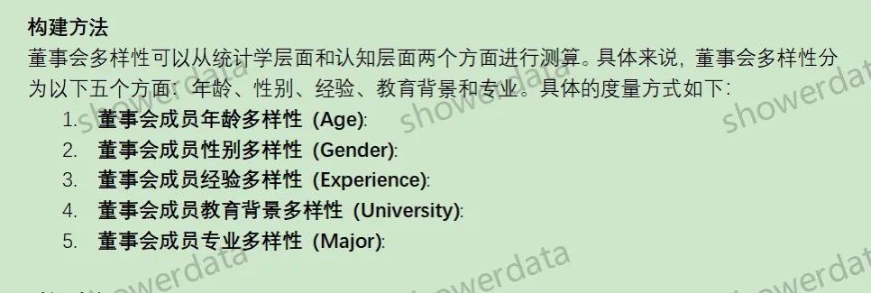

## Body

上市公司董事会多样性指标、董事会结构多样性（1990-2024年）

一、数据介绍
数据名称：上市公司董事会多样性指标、董事会结构多样性
样本范围：A鼓尚视公司,5.9w+观测值（未剔除）
时间范围：1990-2024年（注：23年24年计算出来的数据较少，Csmar数据库提供的数据就这么多加上计算方法 结果相对较少，原始数据和计算方法都有，介意勿拍！！）
数据格式：excel
数据内容：结果、python代码、原始数据

二、数据结果指标如图所示

三、计算方法如图所示

四、参考文献
Kang, Y., Zhu, D. H., & Zhang, Y. A. (2021). Being extraordinary: How CEOS'uncommon names explain strategic distinctiveness. Strategic Management Journal, 42(2), 462-488.

## Images

item_983334101371

Here is a pay link on Stripe ( https://buy.stripe.com/3cs8yP7sY87d0vu9AB ). Please contact me lonlonago@foxmail.com after funding $89, and I will send you a complete data files , thank you!

